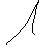
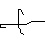
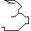

# Hand-written Formula (HWF)

    

This hand-written formula tests the weak-supervised learning setting for parsing and evaluating hand-written formula.
The above example should be representing a formula `1 + 3 / 5` and be evaluated to `1.6`.
In fact the five images and the final result `1.6` are all the training procedure takes in.
Scallop will serve as a differentiable and probabilistic formula parser and evaluator in this case, taking in proabilistic symbol recognition distributions and return the most likely evaluated result.

The context free grammar of this simple expression language is defined formally below:

```
DIGIT     ::= 0 | 1 | ... | 9
MULT_EXPR ::= DIGIT
            | MULT_EXPR * DIGIT
            | MULT_EXPR / DIGIT
ADD_EXPR  ::= MULT_EXPR
            | ADD_EXPR + MULT_EXPR
            | ADD_EXPR - MULT_EXPR
```

The Scallop implementation of the probabilistic parser for this expression language is written in [this file](scl/hwf_parser.scl).
If you wish to see an example of how a program works, checkout [examples/hwf_length_3_top_3_prob.scl](examples/hwf_length_3_top_3_prob.scl) and run it with

```
$ scli examples/hwf_length_3_top_3_prob.scl --provenance topkproofs
```

This file encodes a length-3 expression that most likely evaluates to `1 * 8 = 8`.
But certainly other results will be produced with lower probability too:

```
result: {
  0.063::(0.125),
  0.020870000000000003::(0.5),
  0.14400000000000004::(2),
  0.504::(8),
  0.028::(32)
}
```

## Experiment

To run the experiment, please make sure you have the dataset downloaded.
The folder structure should look like

```
[SCALLOP_V2_DIR]/experiments/data/
> HWF/
  > Handwritten_Math_Symbols/
    > -/
      > -_66.jpg
      > -_87.jpg
    > +/
      > +_10.jpg
      > +_20.jpg
    > 0/...
    > 1/...
    > ...
  > expr_train.json
  > expr_test.json
```

Then do

```
$ python run_with_hwf_parser.py
```
