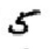
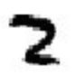

# MNIST Experiments with Scallop

## Sum-2

This task aims to solve the following problem:

<div style="text-align: center">
   +  = 7
</div>

It end-to-end trains a MNIST image recognition with the aid of
Scallop as a differentiable reasoning engine.
The Scallop code embedded in the model is

```
sum_2(a + b) = digit_1(a), digit_2(b)
```

where the facts in `digit_1` and `digit_2` are supplied by the MNIST
image recognition network.

## How to run

``` bash
$ python sum_2.py
```

(Feel free to change `sum_2.py` to other files like `mult_2.py`, `add_sub.py`, `sort_2/run.py`, ...)
